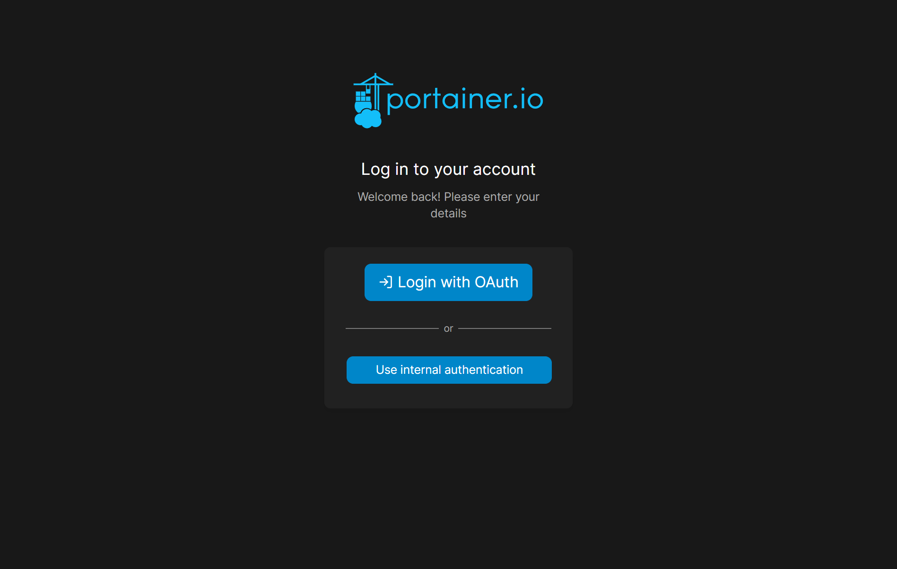

# Homelab Dev Stack

## :scroll: Setup

```bash
# Run all containers
cd ./dev-stack
sudo docker compose up -d

# Setup Nextcloud
sudo docker exec -it homelab-nextcloud /bin/bash -c "sh /root/setup.sh"

# Setup GitLab
sudo docker exec -it homelab-gitlab /bin/bash -c "cat /etc/gitlab/initial_root_password"

# Setup GitLab Runner
sudo docker exec -it homelab-gitlab-runner /bin/bash -c "sed -i 's/concurrent.*/concurrent = 8/' /etc/gitlab-runner/config.toml"
sudo docker exec -it homelab-gitlab-runner /bin/bash -c "cat /etc/gitlab-runner/config.toml"

# Setup Cockpit
# sudo cp ./cockpit/cockpit.conf /etc/cockpit/cockpit.conf && sudo systemctl restart cockpit
```

## Portainer with GitLab OAuth

### GitLab側の操作

1. "Admin area"を開く
2. "Settings" - "Application"を開く
3. 以下を入力し、保存する
    - Scopes:
        - read_user
        - read_api
        - openid
        - profile
        - email
    - Trusted applicat5ino

- 参考資料
    - [Create an instance-wide application | GitLab Docs](https://docs.gitlab.com/ee/integration/oauth_provider.html#create-an-instance-wide-application)

### Portainer側の操作

1. "Settings" - "Authentication"を開く
2. "Authentication settings"で、以下を入力し保存する
    - Configuration:
        - Session lifetime: "1 hour"
    - Authentication method: "OAuth"
    - Single Sign-On:
        - Use SSO: "ON"
    - Automatic user provisioning
        - Automatic user provisioning: "ON"
    - OAuth Configuration
        - Client ID: "<GitLab ApplicationのClient ID>"
        - Client Secret: "<GitLab ApplicationのSecret>"
        - Authorization URL: "<GitLab URL>/oauth/authorize"
        - Access token URL: "<GitLab URL>/oauth/token"
        - Resource URL: "<GitLab URL>/api/v4/user"
        - Redirect URL: "<Portainer URL>"
        - Logout URL: ""
        - User identifier: "username"
        - Scopes: "read_user"
    - Actions
        - "Save settings"
3. ログアウトして、サインイン画面に戻ると"Login With OAuth"ボタンが増えている


- 参考資料
    - [Using oAuth with Gitlab #6117 | GitHub Issues](https://github.com/portainer/portainer/issues/6117)
