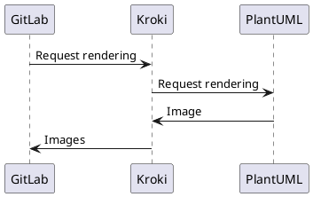
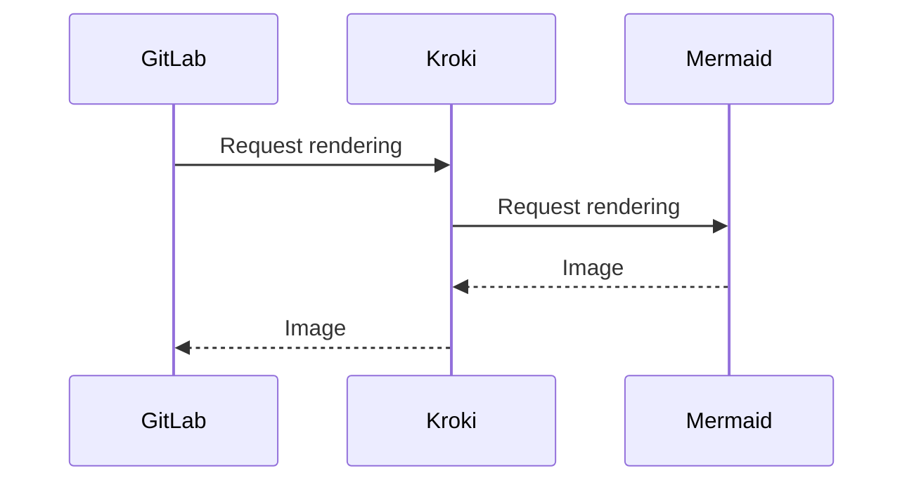

# Kroki! Sample!

## PlantUML

```plantuml
Bob -> Alice : hello
Alice -> Bob : hi
```



```plantuml
@startuml
!include C4_Context.puml

title System Context diagram for Internet Banking System

Person(customer, "Banking Customer", "A customer of the bank, with personal bank accounts.")
System(banking_system, "Internet Banking System", "Allows customers to check their accounts.")

System_Ext(mail_system, "E-mail system", "The internal Microsoft Exchange e-mail system.")
System_Ext(mainframe, "Mainframe Banking System", "Stores all of the core banking information.")

Rel(customer, banking_system, "Uses")
Rel_Back(customer, mail_system, "Sends e-mails to")
Rel_Neighbor(banking_system, mail_system, "Sends e-mails", "SMTP")
Rel(banking_system, mainframe, "Uses")
@enduml
```

```plantuml
digraph finite_state_machine {
	rankdir=LR;
	size="8,5"
	node [shape = doublecircle]; LR_0 LR_3 LR_4 LR_8;
	node [shape = circle];
	LR_0 -> LR_2 [ label = "SS(B)" ];
	LR_0 -> LR_1 [ label = "SS(S)" ];
	LR_1 -> LR_3 [ label = "S($end)" ];
	LR_2 -> LR_6 [ label = "SS(b)" ];
	LR_2 -> LR_5 [ label = "SS(a)" ];
	LR_2 -> LR_4 [ label = "S(A)" ];
	LR_5 -> LR_7 [ label = "S(b)" ];
	LR_5 -> LR_5 [ label = "S(a)" ];
	LR_6 -> LR_6 [ label = "S(b)" ];
	LR_6 -> LR_5 [ label = "S(a)" ];
	LR_7 -> LR_8 [ label = "S(b)" ];
	LR_7 -> LR_5 [ label = "S(a)" ];
	LR_8 -> LR_6 [ label = "S(b)" ];
	LR_8 -> LR_5 [ label = "S(a)" ];
}

```

## Mermaid


